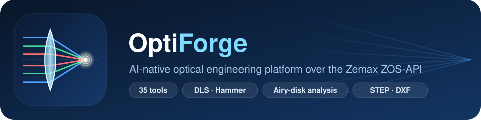
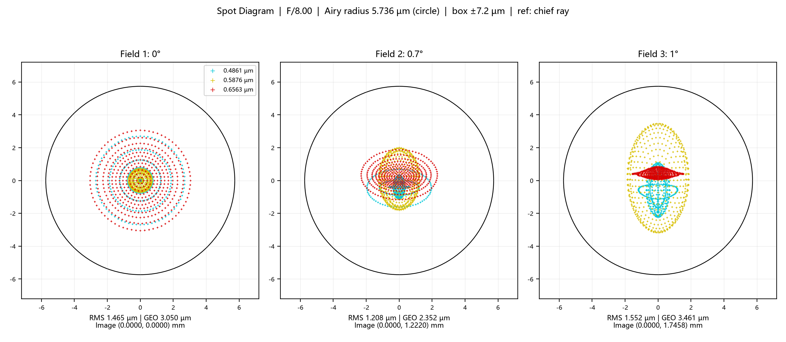

<div align="center">



**Let an AI agent drive Ansys Zemax OpticStudio: from a one-line spec to a diffraction-limited lens, a STEP model and manufacturing drawings.**

**让 AI 智能体直接驱动 Zemax OpticStudio：从一句需求，到衍射极限镜头、STEP 三维模型与加工图纸。**

[](https://www.python.org/)
[](https://www.ansys.com/products/optics/ansys-zemax-opticstudio)
[](https://modelcontextprotocol.io/)
[](#tool-catalog)
[](#quickstart)
[](LICENSE)

[**English**](#english) · [**中文说明**](#中文说明)

</div>

---

<a name="english"></a>
## 🌐 English

### What is it?

**Zemax OpticStudio MCP Server** exposes Ansys Zemax OpticStudio to AI agents (Claude, Gemini, Antigravity, or any other MCP client) through the **Model Context Protocol**. It is built on the **ZOS-API** via `pythonnet` and wraps rules from the *OpticStudio User Manual* for optical engineering and manufacturability.

The agent can take a design through the whole loop:

**spec audit → starting structure → merit function → DLS / Hammer optimization → spot / MTF / wavefront analysis → manufacturing audit → STEP / DXF deliverables**

and it gets structured JSON feedback at every step.

### Highlights

| | |
| :--- | :--- |
| 🧭 **Guided 5-stage design SOP** | Spec audit with recommended defaults, literature and patent search, first-order and Seidel reasoning, a design proposal, and a user approval gate before any simulation. |
| ⚙️ **Robust optimization** | DLS and Hammer, with a pre-flight ray-feasibility check (TIR or missed rays) and a stagnation guard that stops early when ΔMF/MF < 0.5 %. |
| 🎯 **Diffraction-aware analysis** | Spot, FFT MTF, ray fan, wavefront or Strehl, field curvature and distortion. Spot-diagram PNGs are traced with Batch Ray Trace and include the Airy circle. |
| 🏭 **Manufacturing rules built in** | CT and ET limits, air-gap limits (`MXCA ≤ 12 mm`), test-plate steepness, AOI (`RAID`), and a Narcissus / ghost back-reflection audit. |
| 📐 **CAD & drawings** | Headless STEP / IGES / SAT / STL export. Editable DXF element and assembly drawings (ISO 10110 / GB/T 13323). JSON bridge to a SolidWorks MCP. |
| 🗂️ **Project workspaces** | Every design gets its own folder, `output/<project>/{cad,drawings,optomech,reports}`. |

---

### Showcases

#### ⭐ Showcase 1: Diffraction-Limited F/8 Achromatic Doublet (every ray inside the Airy disk)

Using the `achromat_doublet` template as a starting point, the agent screened glass pairs, then ran repeated DLS → Hammer → DLS rounds until it reached a cemented **N-BK7 / N-SF2** doublet. Every ray from every field and wavelength lands inside the Airy disk.



| Field | RMS radius | GEO radius | GEO / Airy radius (5.736 µm) | Strehl | Wavefront RMS |
| :---: | :---: | :---: | :---: | :---: | :---: |
| 0° | 1.575 µm | 3.050 µm | 53 % | 0.991 | 0.015 λ |
| 0.7° | 1.264 µm | 2.352 µm | 41 % | 0.957 | 0.033 λ |
| 1.0° | 1.570 µm | 3.442 µm | 60 % | 0.894 | 0.053 λ |

- **First order**: EFL 100.000 mm, F/8.002, TOTR 108.77 mm, F/d/C wavelengths (0.486 / 0.588 / 0.656 µm).
- **Prescription**: R1 62.844 / 8.000 N-BK7 → R2 −39.605 / 7.334 N-SF2 → R3 −122.520 / BFD 93.432 mm.
- **MTF @ 50 lp/mm**: 0.66 to 0.70 at all fields. Distortion is 0.002 %. The manufacturing rule audit is **PASS** with 0 errors and 0 warnings.

#### Showcase 2: High-NA Water-Immersion Objective (Diffraction-Limited at NA 0.80)

For **reflectance confocal microscopy (RCM / skin CT)**, an AI agent designed and optimized a high-NA water-immersion objective.


- **Aperture & working distance**: $NA = 0.800$ in water ($n=1.32882$), $WD = 3.00\,\text{mm}$.
- **Compact packaging**: $TOTR = 26.00\,\text{mm}$, max element diameter $12.33\,\text{mm}$. The front tip is only $2.88\,\text{mm}$ in diameter, for tissue contact.

| Optical Parameter | Target Requirement | Autonomous Optimization Result | Status |
| :--- | :--- | :--- | :---: |
| **Focal Length ($EFL$)** | $\approx 4.50\,\text{mm}$ (Pairs with $180\,\text{mm}$ tube lens for $40\times$) | **$4.5000\,\text{mm}$** (Water equivalent $5.9797\,\text{mm}$) | **Achieved** |
| **Working Distance ($WD$)** | $\approx 3.00\,\text{mm}$ in water (no cover glass) | **$3.0000\,\text{mm}$** in pure water | **Achieved** |
| **Numerical Aperture ($NA$)**| $\ge 0.80$ in water | **$0.800$** ($EPD = 7.20\,\text{mm}$, half-angle $37.02^\circ$) | **Achieved** |
| **Wavelength Band** | Core $830\,\text{nm}$ ($810 - 850\,\text{nm}$ band) | **$810\,\text{nm} - 850\,\text{nm}$ fully corrected** | **Achieved** |
| **Field of View ($FOV$)** | $\varnothing 0.66\,\text{mm}$ ($y = \pm 0.33\,\text{mm}$) | **$\varnothing 0.66\,\text{mm}$** (Semi-field angle $4.19^\circ$) | **Achieved** |
| **Strehl Ratio ($S$)** | Diffraction-limited ($S \ge 0.80$) | **$S \ge 0.953$ across all fields & wavelengths** | **Surpassed** |
| **Narcissus Back-Reflection**| Zero pinhole ghost focus | **All $\|i\| \ge 4.58^\circ$, pinhole rejection $> 99.999\%$** | **Achieved** |

<details>
<summary><b>Aberration charts: MTF, spot vs. Airy disk, Narcissus audit</b></summary>

**FFT MTF**: contrast stays above 0.86 at $117.7\,\text{lp/mm}$ for all fields.


**Spot diagram vs. Airy disk**: every field point falls near or inside the Airy radius in water ($r_{\text{Airy}} = 0.8422\,\mu\text{m}$).


**Narcissus / ghost audit**: all 15 surfaces avoid normal-incidence retroreflection ($|i| \ge 4.58^\circ$). At the pinhole plane the ghost disks are defocused to between 28 and 238 mm, which gives more than 85 dB of stray-light isolation.


</details>

#### Showcase 3: Ultra-Compact 4f Relay ($f_{\text{SL}}=37.5\,\text{mm}$, $f_{\text{TL}}=75.0\,\text{mm}$ Thorlabs AC254-075-B)

The standard 50 / 100 mm relay had two problems:
- The beam overflowed at the tube lens: $D_{\text{beam}} = 21.94\,\text{mm}$, larger than the $21.5\,\text{mm}$ SM1 aperture.
- The track length was over 417 mm.

Using the modular protocol and the stagnation guard, the agent redesigned the relay into a compact layout:


| Metric / Parameter | Baseline (50mm / 100mm) | Ultra-Compact Redesign (37.5mm / 75mm) | Improvement / Status |
| :--- | :---: | :---: | :---: |
| **Scan Lens Focal Length** | $50.0\,\text{mm}$ | **$37.5\,\text{mm}$** (Doublet S-LAL18/S-TIH1 + Singlet S-BSM16) | Compact, retrofocus telecentric |
| **Tube Lens Hardware** | $100.0\,\text{mm}$ Custom | **$75.0\,\text{mm}$ (Thorlabs AC254-075-B)** | Commercial COTS Standard |
| **Tube Lens Beam Envelope** | $21.94\,\text{mm}$ (Severe clipping!) | **$7.44\,\text{mm} \sim 13.72\,\text{mm}$** | **Zero overflow, +36.2% clear safety margin** |
| **Total Track Length (Galvo $\to$ Object)**| $417.6\,\text{mm}$ | **$191.1\,\text{mm}$** | **Shortened by 226.5 mm (54.2% reduction, < 200mm)** |
| **Pupil Magnification ($M_{\text{pupil}}$)** | $2.0\times$ ($3.6 \to 7.2\,\text{mm}$) | **$2.0\times$ ($3.60 \to 7.20\,\text{mm}$)** | **100% full pupil illumination** |
| **Water Immersion NA** | $0.8009$ | **$0.800$** ($WD = 3.016\,\text{mm}$ in pure water) | **High-resolution optical sectioning** |
| **Optimization Guard Performance** | Ran blind cycles | **Early stop at Round 7 ($\Delta MF < 0.09\%$)** | **Zero stagnation, complete convergence** |
| **Optomechanical Deliverables** | - | **3D CAD STEP (3.27 MB), ISO 10110 Drawings, SolidWorks Bridge JSON** | **Direct CNC & SolidWorks assembly ready** |

---

### Key Capabilities

1. **Autonomous Optical Design & Optimization**
   - The server exposes **35 tools**, **7 resources** and the `optical_design_workflow` prompt. The tools cover optics, project management and CAD. The resources cover the current system, rules, the operand catalog, the SOP, the active proposal and the expert manuals.
   - It supports progressive optimization pipelines: radius tuning, air and glass thickness solves, DLS and Hammer solvers, and multi-stage merit function setup.
   - There are three starting templates: `singlet_bk7`, `achromat_doublet` and `cooke_triplet`.

2. **Mandatory 5-Stage Closed-Loop Design Protocol (SOP)**
   ```mermaid
   flowchart TD
       Req["1. User Proposes Initial Optical Request"] --> Step0["Stage 0: zemax_audit_requirements\n(ORS Completeness Audit)"]
       Step0 --> Check{Missing Core Specs?}
       Check -- "Yes (NEEDS_CLARIFICATION)" --> Clarify["Interactive Dialog with Recommended Industry Defaults\n(Halt & Refine Specs)"]
       Clarify --> Req
       Check -- "No (READY_FOR_DESIGN)" --> Step1["Stage 1: Web & Patent Search\n(Retrieve Proven Baseline Topology)"]
       Step1 --> Step2["Stage 2: Deep Optical Thinking\n(Gaussian / Seidel / DFM / Air Gaps <= 12mm / Glass Pairing)"]
       Step2 --> Step3["Stage 3: zemax_register_design_proposal\n(Generate Structured Engineering Proposal)"]
       Step3 --> Step4["Stage 4: User Confirmation Gate\n(HALT: Must Obtain Explicit Approval)"]
       Step4 --> Appr{User Approved?}
       Appr -- "Approved" --> Sim["Zemax Automated Modeling, DLS/Hammer &\nAberration Verification"]
       Appr -- "Needs Revision" --> Step2
   ```
   - **Stage 0 (Spec completeness audit)**: `zemax_audit_requirements` checks the request against an Optical Requirements Specification (ORS). If core parameters are missing (EFL, F/#, FOV, wavelength, pixel pitch, WD), it asks the user and suggests industry defaults.
   - **Stage 1 (Starting structure)**: no trial-and-error from scratch. The agent must search the web and patent databases for a proven baseline topology.
   - **Stage 2 (Deep optical reasoning)**:
     - Gaussian first-order power distribution and a Seidel aberration budget.
     - Preferred glasses (CDGM / Schott).
     - Internal air gaps limited to $\le 12.0\,\text{mm}$.
     - DFM checks on test-plate steepness.
   - **Stage 3 (Design proposal)**: `zemax_register_design_proposal` records a structured proposal for engineering review.
   - **Stage 4 (User confirmation gate)**: the agent must stop and get explicit approval before it runs any simulation or optimization.

3. **Embedded Engineering & Manufacturing Rules**
   - **Air spacing & barrel length**:
     - Internal air gaps are limited to $t_{\text{air}} \le 12.0\,\text{mm}$ with `MXCA`, and the lens stack length is limited with `TTHI`.
     - This stops the solver from inflating air spaces to cheat on Petzval curvature.
   - **Center & edge thickness**: $CT \ge 1.0\,\text{mm}$ and $ET \ge 0.8 - 1.5\,\text{mm}$. These prevent polishing warp and knife-edge chipping.
   - **Test-plate steepness & AOI**:
     - Radii must satisfy $|R| \ge 1.2 \sim 1.5 \times \text{Semi-Diameter}$, which rules out hyper-hemispheric surfaces.
     - Ray bending is kept to $i \le 30^\circ \sim 45^\circ$ with `RAID`, so the mechanical tolerances can stay loose.
   - **Air-space clearance**: $MNCA \ge 0.5\,\text{mm}$ and $MNEA \ge 0.8\,\text{mm}$ leave flat mounting lands for spacer rings.
   - **Aberration metric transition**: the server computes the Airy radius, $r_{\text{Airy}} = 0.61 \lambda / NA$. Once the design is in the diffraction-limited regime, the merit function switches from spot size to RMS wavefront.
   - **Narcissus / ghost audit**: finds normal-incidence retroreflections ($i \approx 0^\circ$) in reflectance confocal systems, which would otherwise saturate the pinhole.

4. **Optimization Stagnation Guard & Ray Feasibility Pre-Flight**
   - **Pre-flight ray feasibility**:
     - Before DLS or Hammer starts, the server scans the active merit-function operands.
     - Total internal reflection or a missed surface produces a $1\times 10^6$ penalty in an operand. When that happens, optimization aborts and reports which surface failed.
   - **Stagnation guard**:
     - Local optimization runs in 10-cycle chunks and logs each chunk.
     - If the relative improvement falls below $0.5\%$ ($\Delta MF / MF < 0.005$), the run stops early.

5. **Multi-Group & Modular System Protocol (Decoupling & Anti-Compensation)**
   - **Four interface decoupling contracts**:
     - *Pupil conjugation*:
       - The scanner pivot (system STOP) is conjugate to the objective entrance pupil (BFP).
       - Pupil magnification is $M_{\text{pupil}} = f_{\text{tube}} / f_{\text{scan}} = D_{\text{BFP}} / D_{\text{galvo}}$.
       - The result is full pupil fill and no pupil walk across scan angles.
     - *Intermediate image & double telecentricity*:
       - The scan lens is image-space telecentric ($CRA \le 0.5^\circ$) and the tube lens is object-space telecentric.
       - The intermediate image must be flat and diffraction-limited ($\le 0.04\lambda$), so aberrations don't leak between modules.
     - *Infinity space*: the tube lens outputs collimated light ($\theta \le 0.001^\circ$), which preserves the objective's native aplanatic balance.
     - *Beam envelope & clear aperture*:
       - The beam envelope at the tube lens is checked quantitatively: $D_{\text{beam\_TL}} = 2 \cdot f_{\text{scan}} \cdot \tan\theta_{\text{scan}} + D_{\text{obj\_pupil}}$.
       - The mechanical clear aperture needs at least a 15 % margin over it.
   - **Standard 5-stage modular workflow**:
     1. Paraxial layout, with the Lagrange invariant split between modules.
     2. Aberration budget by RSS: $\sigma_{\text{obj}} \le 0.045\lambda$, $\sigma_{\text{scan}} \le 0.035\lambda$, $\sigma_{\text{tube}} \le 0.030\lambda$.
     3. Each sub-module designed offline.
     4. Isolation tests with a paraxial lens standing in for the other modules.
     5. A 4-step progressive release: freeze everything → tune relay air spaces → damped ±5 % curvature fine-tuning → wavefront lock.
   - **Operand "iron curtain" (anti-compensation)**: barrier operands keep modules from compensating for each other:
     - `EFLA` pins each subgroup focal length.
     - `REAB` / `RAED` keep the exit beam collimated.
     - `REAY` fixes the pupil beam size and chief-ray height.
     - `RAID` limits the CRA at the intermediate image.
     - `MXCA` limits intra-module air gaps to ≤ 12 mm.
     - `MNEG` keeps glass edges ≥ 1.2 mm, and `MNEA` keeps air-edge clearance ≥ 0.8 mm.
   - **DFM & drop-in barrel assembly**:
     - Single barrels keep $L/D \le 2.0 \sim 2.5:1$ and element diameters are unified.
     - Flat mounting lands ($W \ge 0.8 \sim 1.5\,\text{mm}$ with a $0.3\,\text{mm}\times 45^\circ$ chamfer) allow drop-in assembly without optical surfaces touching the barrel.

6. **2D CAD Drawings (GB/T 13323 & ISO 10110 / ezdxf), 3D CAD & Optomechanical Linkage**
   - **`zemax_export_optical_drawing`**:
     - Outputs editable AutoCAD R2010 `.dxf` files, 300 DPI `.png` previews and Markdown manufacturing specifications.
     - Uses an A4 landscape frame with a 4-tier title block, the third-angle projection symbol and a surface-roughness block. The company-name block is intentionally left out.
     - The specification table uses balanced column widths and a width factor, so long strings don't overflow. Assembly drawings include a BOM with adaptive font scaling.
     - Everything is pure Python (`ezdxf` + `matplotlib`). **No SolidWorks is required.**
   - **`zemax_export_cad`**: headless STEP, IGES, SAT and STL export from the Zemax engine, with optional ray bundles.
   - **`zemax_export_prescription_for_cad`**:
     - Converts the Zemax prescription into JSON for a downstream SolidWorks MCP (`build_system_from_prescription`).
     - The payload includes spacer, retaining-ring and stepped-barrel parameters.

7. **Project Workspace Isolation**
   - Each design gets its own folder, `output/<project_name>/`, with these subfolders:
     - `cad/`
     - `drawings/`
     - `optomech/`
     - `reports/`
   - Managed with `zemax_set_project`, `zemax_get_project` and `zemax_list_projects`.

8. **Connection Modes**
   - **Standalone (default)**: the server starts a headless OpticStudio instance in the background, suited to automated batch work.
   - **Interactive**: the session layer can attach to an OpticStudio GUI that is already running (`ZOSSession.connect_interactive`). This mode is not exposed as an MCP tool yet.

---

<a name="tool-catalog"></a>
### Tool Catalog (35 Tools)

| Group | Tools |
| :--- | :--- |
| **System & ORS** | `zemax_audit_requirements`, `zemax_system_info`, `zemax_register_design_proposal`, `zemax_new_file`, `zemax_load_file`, `zemax_save_file`, `zemax_get_system_data`, `zemax_load_template` |
| **Project Workspace** | `zemax_set_project`, `zemax_get_project`, `zemax_list_projects` |
| **Optical Setup** | `zemax_set_aperture`, `zemax_set_fields`, `zemax_set_wavelengths`, `zemax_set_ray_aiming` |
| **Surfaces & Solves** | `zemax_surface_operations`, `zemax_insert_surface`, `zemax_delete_surface`, `zemax_set_solve` |
| **Optimization** | `zemax_setup_merit_function`, `zemax_add_operand`, `zemax_quick_focus`, `zemax_run_optimization`, `zemax_run_hammer` |
| **Analysis** | `zemax_run_spot_diagram`, `zemax_run_fft_mtf`, `zemax_run_ray_fan`, `zemax_run_wavefront_map`, `zemax_run_field_curvature_distortion`, `zemax_export_spot_diagram_plot` (Batch Ray Trace spot PNG with Airy circle) |
| **Validation & Knowledge** | `zemax_validate_design_rules`, `zemax_lookup_manual` |
| **Optomechanics & CAD** | `zemax_export_cad`, `zemax_export_optical_drawing`, `zemax_export_prescription_for_cad` |

**Resources**:
- `zemax://system/current`
- `zemax://rules/summary`
- `zemax://operands/catalog`
- `zemax://workflow/sop`
- `zemax://proposal/current`
- `zemax://manual/expert_compactness_guide`
- `zemax://manual/expert_design_guide`

**Prompt**: `optical_design_workflow`

---

<a name="quickstart"></a>
### Quickstart

#### Requirements
- Windows 10/11 x64
- Ansys Zemax OpticStudio 2021 or later, with a license that permits ZOS-API use (Premium, Professional or Enterprise)
- Python 3.10+
- Dependencies (`requirements.txt`): `pythonnet`, `fastmcp`, `matplotlib`, `numpy`, `pydantic`, `ezdxf`

#### Installation
```powershell
git clone https://github.com/zhaopeizhao41-ops/zemax-opticstudio-mcp.git
cd zemax-opticstudio-mcp
pip install -r requirements.txt
```

#### MCP Client Configuration
Add the server to your MCP client configuration, for example Claude Desktop or Claude Code (`.mcp.json`):
```json
{
  "mcpServers": {
    "zemax": {
      "command": "python",
      "args": ["<PATH_TO_REPO>/server.py"]
    }
  }
}
```

#### Run the integration tests (requires OpticStudio)
```powershell
python tests/test_zemax_tools.py
```

#### Repository Layout
```text
server.py        FastMCP entry point (tools, resources, prompt)
core/            ZOS-API session and .NET converters
domain/          Design templates, Zemax rules, operand knowledge base, expert manual
tools/           Tool implementations (system, setup, surfaces, optimization, analysis, validation, CAD)
tests/           Integration test suite
assets/          README figures and logo
output/          Per-project workspaces (git-ignored)
```

---
---

<a name="中文说明"></a>
## 🇨🇳 中文说明

### 这是什么？

**Zemax OpticStudio MCP Server** 通过 **Model Context Protocol（MCP）** 把 Ansys Zemax OpticStudio 开放给 AI 智能体使用，支持 Claude、Gemini、Antigravity 以及其他 MCP 客户端。它基于 `pythonnet` 调用 **ZOS-API**，并内置了《OpticStudio 用户手册》中的光学工程设计规范和可制造性准则。

智能体可以独立完成整个设计闭环：

**需求审查 → 初始结构 → 评价函数 → DLS / Hammer 优化 → 点列图 / MTF / 波前分析 → 制造性审计 → 输出 STEP / DXF**

每一步都会返回结构化的 JSON 结果。

### 亮点速览

| | |
| :--- | :--- |
| 🧭 **五步闭环设计流程** | 需求审查（附推荐默认值）、检索专利与文献、一阶与 Seidel 推演、登记设计方案，并在仿真前等待用户确认。 |
| ⚙️ **稳健的优化** | 支持 DLS 与 Hammer。优化前先检查光线可行性（全反射、光线逸出），ΔMF/MF < 0.5 % 时自动停止。 |
| 🎯 **衍射级像质分析** | 点列图、FFT MTF、光扇图、波前与 Strehl、场曲与畸变。点列图 PNG 由 Batch Ray Trace 追迹生成，并画出艾里斑圆。 |
| 🏭 **内置制造规则** | 中心厚与边缘厚限制、空气间隔上限（`MXCA ≤ 12 mm`）、检验样板陡度、入射角（`RAID`），以及水仙花效应 / 鬼像审计。 |
| 📐 **CAD 与工程图** | 无头导出 STEP / IGES / SAT / STL；生成可编辑的 DXF 元件图和装配图（ISO 10110 / GB/T 13323）；可通过 JSON 对接 SolidWorks MCP。 |
| 🗂️ **项目工作区** | 每个设计独立一个目录：`output/<project>/{cad,drawings,optomech,reports}`。 |

---

### 案例展示

#### ⭐ 案例一：F/8 衍射极限消色差双胶合物镜（全部光线落在艾里斑内）

智能体以 `achromat_doublet` 模板为起点，先做玻璃组合筛选，再反复执行"DLS → Hammer → DLS"，最终得到 **N-BK7 / N-SF2** 胶合双透镜。所有视场、所有波长的全部光线都落在艾里斑内。


| 视场 | RMS 半径 | GEO 半径 | GEO / 艾里半径（5.736 µm） | Strehl | 波前 RMS |
| :---: | :---: | :---: | :---: | :---: | :---: |
| 0° | 1.575 µm | 3.050 µm | 53 % | 0.991 | 0.015 λ |
| 0.7° | 1.264 µm | 2.352 µm | 41 % | 0.957 | 0.033 λ |
| 1.0° | 1.570 µm | 3.442 µm | 60 % | 0.894 | 0.053 λ |

- **一阶参数**：EFL 100.000 mm，F/8.002，总长 TOTR 108.77 mm。波长为 F/d/C（0.486 / 0.588 / 0.656 µm）。
- **结构**：R1 62.844 / 8.000 N-BK7 → R2 −39.605 / 7.334 N-SF2 → R3 −122.520 / 后截距 93.432 mm。
- **MTF @ 50 lp/mm**：全视场 0.66 至 0.70。畸变 0.002 %。制造规则审计 **PASS**（0 个严重错误，0 个警告）。

#### 案例二：高数值孔径水浸物镜（NA 0.80 衍射极限）

这是一款为**反射式共聚焦显微镜（RCM / 皮肤 CT）**设计的高 NA 水浸物镜，由 AI 智能体完成设计与优化。


- **结构特色**：前组透镜通光外径仅 **$2.88\,\text{mm}$**，工作距离为 **$3.00\,\text{mm}$**。可以做成 $30^\circ$ 锥角探头，便于贴合活体皮肤。
- **水浸环境**：在纯水介质中（$830\,\text{nm}$ 处 $n=1.32882$）完成全孔径边缘光线的对焦校正。

| 光学 / 机械指标 | 规格要求 | 最终达成值 | 状态 |
| :--- | :--- | :--- | :---: |
| **等效焦距 ($EFL$)** | $\approx 4.50\,\text{mm}$ (配 $180\,\text{mm}$ 筒镜实现 $40\times$) | **$4.5000\,\text{mm}$** (水介质等效 $5.9797\,\text{mm}$) | **100% 达成** |
| **工作距离 ($WD$)** | $\approx 3.00\,\text{mm}$ (水浸无盖玻片, $t=0$) | **$3.0000\,\text{mm}$** (纯水介质) | **100% 达成** |
| **数值孔径 ($NA$)** | $\ge 0.80$ (水浸高分辨) | **$0.800$** ($EPD = 7.20\,\text{mm}$，孔径半角 $37.02^\circ$) | **100% 达成** |
| **工作波长** | 核心 $830\,\text{nm}$ (窄带 $810 - 850\,\text{nm}$) | **$810\,\text{nm} - 850\,\text{nm}$ 全波段校正** | **100% 达成** |
| **物面成像视场** | $\varnothing 0.66\,\text{mm}$ ($y = \pm 0.33\,\text{mm}$) | **$\varnothing 0.66\,\text{mm}$** (全视场角 $8.38^\circ$) | **100% 达成** |
| **全视场像质 (Strehl)**| 严格全视场衍射极限 ($S \ge 0.80$) | **全波段全视场 $S = 0.953 \sim 0.971$** | **超额达成** |
| **水仙花效应 (Narcissus)**| 严禁物镜表面反射聚焦于后焦面/针孔面 | **全表面反射发散，针孔杂散光截留隔离 $> 99.999\%$** | **严格达标** |

<details>
<summary><b>像差分析图表：MTF、点列图与艾里斑对比、水仙花效应审计</b></summary>

**FFT MTF**：在 $0 \sim 120\,\text{lp/mm}$ 频段内，全视场在 $117.7\,\text{lp/mm}$ 处的对比度仍有 **$0.865 \sim 0.890$**。


**点列图与水浸艾里斑对比**：轴上复色 RMS 弥散斑半径为 **$0.8118\,\mu\text{m}$**，小于水中艾里斑半径 $0.8422\,\mu\text{m}$。全视场 RMS 半径都不超过 $1.15\,\mu\text{m}$。


**水仙花效应（鬼像背向反射）审计**：各表面边缘光线的反射入射角在 $4.58^\circ \sim 41.31^\circ$ 之间，在针孔平面形成直径 **$28.7 \sim 237.7\,\text{mm}$** 的离焦弥散斑。配合 $50\,\mu\text{m}$ 针孔，反向杂散光衰减超过 **$99.999\%$**（抑制比优于 **$-85\,\text{dB}$**）。


</details>

#### 案例三：超紧凑 4f 共聚焦中继系统（37.5 mm / 75 mm Thorlabs AC254-075-B）

在手持共聚焦探头的整机校核中，传统 $50\,\text{mm} / 100\,\text{mm}$ 中继方案有两个问题：
- 筒镜处光束溢出：边缘光束包络 $21.94\,\text{mm}$，超过 1 英寸镜座 $21.5\,\text{mm}$ 的通光口径。
- 系统总长超过 $417\,\text{mm}$。

借助模块化解耦规范和优化停滞保护，智能体重新设计了中继系统：


| 系统设计参数 | 原基准方案 (50mm / 100mm) | 最新重构方案 (37.5mm / 75mm) | 工程改善与达成状态 |
| :--- | :---: | :---: | :---: |
| **扫描透镜拓扑** | $50.0\,\text{mm}$ 双分离双胶合 | **$37.5\,\text{mm}$** (双胶合 S-LAL18/S-TIH1 + 单透镜 S-BSM16) | 紧凑型反远距远心物镜 |
| **筒镜硬件选型** | $100.0\,\text{mm}$ 非标定制 | **$75.0\,\text{mm}$ (Thorlabs AC254-075-B)** | **标准商用货架品 (COTS)** |
| **筒镜处全光束包络直径** | $21.94\,\text{mm}$ (严重溢出截光!) | **$7.44\,\text{mm} \sim 13.72\,\text{mm}$** | **彻底消除溢出！光束极大收缩** |
| **1英寸 (SM1, Ø21.5mm) 净通光余量** | $-2.0\%$ (边缘视场渐晕截光) | **$+36.2\%$ (+7.78 mm 充裕净空)** | **安全余量提升 38.2%，杜绝一切渐晕** |
| **整机光学总轨长 (振镜 $\to$ 物面)** | $417.6\,\text{mm}$ | **$191.1\,\text{mm}$** | **直接缩短 226.5 mm（缩短 54.2%，稳进 200mm 以内）** |
| **光瞳放大率 ($M_{\text{pupil}}$)** | $2.0\times$ ($3.6 \to 7.2\,\text{mm}$) | **$2.0\times$ ($3.60 \to 7.20\,\text{mm}$)** | **100% 满瞳照明（物镜入射 $\varnothing 7.20\,\text{mm}$）** |
| **水浸实际数值孔径 ($NA$)** | $0.8009$ | **$0.800$** ($WD = 3.016\,\text{mm}$ 纯水介质) | **高分辨率共聚焦光学层切** |
| **优化防停滞叫停机制表现** | 盲目迭代无输出 | **Round 7 检测到 $\Delta MF < 0.09\%$ 主动叫停** | **耗时仅数秒，零无效计算与空转假死** |
| **光机工程全套交付物** | - | **3D CAD STEP (3.27 MB)、ISO 10110 加工图纸、SolidWorks 桥接 JSON** | **无缝支持数控车削加工与 SolidWorks 一键建模** |

---

### 核心特性

1. **AI 闭环光学自主设计**
   - 提供 **35 个工具**、**7 项资源**和 `optical_design_workflow` 设计提示词。工具涵盖光学、项目管理与 CAD；资源包括当前系统、规则、操作数目录、SOP、当前方案和专家手册。
   - 智能体用自然语言即可完成全流程：需求审查、载入初始结构、配置视场与波长、设置曲率和厚度变量、构建评价函数、多阶段 DLS 优化，以及生成全套像差图表。
   - 内置三个初始结构模板：`singlet_bk7`、`achromat_doublet`、`cooke_triplet`。

2. **强制执行的五步闭环设计流程（SOP）**
   ```mermaid
   flowchart TD
       Req["1. 用户提出初始设计需求"] --> Step0["阶段零: zemax_audit_requirements\n(ORS 需求完备性审查)"]
       Step0 --> Check{是否缺失核心参数?}
       Check -- "是 (NEEDS_CLARIFICATION)" --> Clarify["交互式追问并附带行业经典推荐默认值\n(强制暂停并补充参数)"]
       Clarify --> Req
       Check -- "否 (READY_FOR_DESIGN)" --> Step1["阶段一: 联网检索成熟初始架构\n(检索 USPTO / Google Patents / 光学文献)"]
       Step1 --> Step2["阶段二: 深度光学推演思考\n(高斯光焦度 / 像差平衡 / 优选玻璃 / 空气隙<=12mm / DFM样板比)"]
       Step2 --> Step3["阶段三: zemax_register_design_proposal\n(输出规范化《光学设计提案报告》)"]
       Step3 --> Step4["阶段四: 用户决策门禁 HALT & ASK\n(强制暂停并征询用户审批)"]
       Step4 --> Appr{用户是否批准?}
       Appr -- "批准同意" --> Sim["启动 Zemax 建模仿真、DLS/Hammer 自动优化与像差验证"]
       Appr -- "提出修改" --> Step2
   ```
   - **阶段零（需求完备性审查）**：调用 `zemax_audit_requirements`，对照光学需求规格书（ORS）检查需求。如果缺少关键指标（EFL、F/#、FOV、波段、像元尺寸、BFL/TOTR），会向用户追问，并给出推荐的默认值。
   - **阶段一（检索初始结构）**：不凭空假设参数。必须先在专利库（USPTO、Google Patents）和经典光学手册（Smith、Kingslake）中查找最匹配的初始结构。
   - **阶段二（光学推演）**：
     - 高斯一阶光焦度分配：$EPD = EFL / F\#$，$H = nuy$。
     - 初级与高级像差平衡。
     - 优先选用常备玻璃（CDGM / Schott）。
     - 内部空气间隔不超过 $12.0\,\text{mm}$。
     - 检验样板陡度比 $|R|/y \ge 1.2$。
   - **阶段三（登记设计方案）**：调用 `zemax_register_design_proposal` 生成结构化的《光学设计提案报告》，列出指标、选型依据、理论分析和分阶段优化计划。
   - **阶段四（用户确认）**：方案提交后必须停下来等用户确认。得到明确同意之前，不得调用任何 Zemax 建模或优化工具。

3. **内置工程制造与装配规则**
   - **内部空气间隔与总长**：
     - 用 `MXCA` 把透镜组内部空气间隔限制在 $12.0\,\text{mm}$ 以内，用 `TTHI` 限制首尾面之间的总长。
     - 这样可以防止优化器靠拉大空气间隔来躲避像差校正。
   - **透镜厚度**：中心厚 $CT \ge 1.0\,\text{mm}$，防止研磨变形；边缘厚 $ET \ge 0.8 \sim 1.5\,\text{mm}$，防止刀口边和装配崩边。
   - **检验样板陡度与入射角**：
     - 曲率半径满足 $|R| \ge 1.2 \sim 1.5 \times \text{Semi-Diameter}$，排除超半球的深凹面。
     - 用 `RAID` 把光线最大入射角控制在 $30^\circ \sim 45^\circ$ 以内，放宽公差要求。
   - **像差评价自适应**：根据 F 数和主波长计算艾里斑半径（$r_{\text{Airy}} = 0.61 \lambda / NA$）。弥散斑进入艾里斑后，评价标准自动从几何点列图切换为 RMS 波前差。
   - **水仙花效应审计**：面向反射式共聚焦（RCM）等弱信号系统，逐面检查自准直逆反射，并计算其在针孔处的衰减。

4. **优化停滞保护与光线可行性预检**
   - **光线可行性预检**：
     - 启动局部优化前，先检查评价函数中所有有效操作数。
     - 如果全反射、光线逸出或截断让某个操作数变成 $1\times 10^6$ 惩罚值或 NaN，就立即停止并指出出问题的表面。
   - **停滞保护**：
     - 优化以每 10 个循环为一批进行，并实时输出每批的收敛情况。
     - 相邻两批的相对改善低于 $0.5\%$ 时主动停止，不做无效迭代。

5. **多镜组 / 模块化系统设计规范（接口解耦与防代偿）**
   - **四项接口解耦约定**：
     - *光瞳共轭*：
       - 振镜偏转中心（系统光阑）与物镜入瞳严格共轭。
       - 光瞳放大率 $M_{\text{pupil}} = f_{\text{tube}} / f_{\text{scan}} = D_{\text{BFP}} / D_{\text{galvo}}$。
       - 这样物镜可以满瞳照明，扫描时光瞳也不会漂移。
     - *中间像面与双远心*：
       - 扫描透镜像方远心（$CRA \le 0.5^\circ$），筒镜物方远心。
       - 中间像面本身须达到衍射极限平场（$\le 0.04\lambda$），不能留下大的场曲或像散指望后组补偿。
     - *平行光出射*：筒镜出射光为准直平行光（$\le 0.001^\circ$），以保持物镜原有的齐明设计。
     - *光束包络与通光余量*：
       - 定量核算筒镜处的光束包络：$D_{\text{beam\_TL}} = 2 \cdot f_{\text{scan}} \cdot \tan\theta_{\text{scan}} + D_{\text{obj\_pupil}}$。
       - 机械通光口径至少预留 15 % 余量。
   - **模块化五阶段流程**：
     1. 近轴布局，并在各模块间分配拉格朗日不变量。
     2. 用 RSS 方式分配像差预算。
     3. 各子模块独立设计。
     4. 用理想近轴透镜替代其他模块做隔离测试。
     5. 分四步逐级联调：全部冻结 → 只放开模块间隔 → 曲率 ±5 % 阻尼微调 → 锁定 RMS 波前。
   - **评价函数"铁幕"防代偿**：预先加入以下约束操作数，防止模块之间互相代偿、优化器跑偏：
     - `EFLA`：锁定各子组焦距。
     - `REAB` / `RAED`：锁定出射光平行。
     - `REAY`：锁定光瞳口径和主光线高度。
     - `RAID`：锁定中间像面主光线角。
     - `MXCA`：内部气隙不超过 12 mm。
     - `MNEG`：玻璃边缘厚不小于 1.2 mm。
     - `MNEA`：空气边缘间隙不小于 0.8 mm。
   - **面向制造与装配**：
     - 单镜筒长径比 $L/D \le 2.0 \sim 2.5:1$，镜片外径尽量统一。
     - 镜片边缘留出平直装配台（$W \ge 0.8 \sim 1.5\,\text{mm}$，带 $0.3\,\text{mm}\times 45^\circ$ 倒角），支持落入式装配，避免曲面与镜筒线接触。

6. **2D CAD 矢量工程图（GB/T 13323 / ISO 10110 / ezdxf）、3D CAD 与光机协同**
   - **`zemax_export_optical_drawing`**：
     - 输出可编辑的 AutoCAD R2010 `.dxf`、300 DPI 的 `.png` 预览和 Markdown 制造规范，可以在 AutoCAD、中望 CAD、SolidWorks 中直接编辑。
     - 图纸采用 A4 横向国标图框、四栏标题栏、第三角投影符号和右上角的表面粗糙度统一标注。标题栏按要求不含单位名称。
     - 光学特性表采用平衡的列宽和文字宽度因子，长字符串不会溢出边框。装配图带 BOM 明细表，字号可自适应。
     - 全部由 Python 生成（`ezdxf` + `matplotlib`），**不需要安装 SolidWorks**。
   - **`zemax_export_cad`**：在后台由 Zemax 内核导出 STEP、IGES、SAT、STL 实体，可选附带光线路径。
   - **`zemax_export_prescription_for_cad`**：
     - 把 Zemax 处方转换为 SolidWorks MCP（`build_system_from_prescription`）所需的 JSON。
     - 同时计算隔圈、压圈和阶梯镜筒的参数。

7. **项目工作区隔离**
   - 每个设计项目有自己的目录 `output/<project_name>/`，下设以下子目录：
     - `cad/`
     - `drawings/`
     - `optomech/`
     - `reports/`
   - 通过 `zemax_set_project`、`zemax_get_project`、`zemax_list_projects` 管理。

8. **连接模式**
   - **Standalone 模式（默认）**：在后台启动无头 OpticStudio 进程，适合自动化批处理。
   - **Interactive 模式**：会话层支持连接已经在运行的 OpticStudio 界面（`ZOSSession.connect_interactive`），目前还没有做成 MCP 工具。

---

### 工具目录（35 个）

| 分组 | 工具 |
| :--- | :--- |
| **系统与需求管理** | `zemax_system_info`, `zemax_audit_requirements`, `zemax_register_design_proposal`, `zemax_new_file`, `zemax_load_file`, `zemax_save_file`, `zemax_get_system_data`, `zemax_load_template` |
| **项目工作区** | `zemax_set_project`, `zemax_get_project`, `zemax_list_projects` |
| **光学参数配置** | `zemax_set_aperture`, `zemax_set_fields`, `zemax_set_wavelengths`, `zemax_set_ray_aiming` |
| **表面与求解器** | `zemax_surface_operations`, `zemax_insert_surface`, `zemax_delete_surface`, `zemax_set_solve` |
| **优化与评价函数** | `zemax_setup_merit_function`, `zemax_add_operand`, `zemax_quick_focus`, `zemax_run_optimization`, `zemax_run_hammer` |
| **光学性能分析** | `zemax_run_spot_diagram`, `zemax_run_fft_mtf`, `zemax_run_ray_fan`, `zemax_run_wavefront_map`, `zemax_run_field_curvature_distortion`, `zemax_export_spot_diagram_plot`（光线追迹点列图 PNG，含艾里斑圆） |
| **规则审计与知识库** | `zemax_validate_design_rules`, `zemax_lookup_manual` |
| **光机工程与 CAD** | `zemax_export_cad`, `zemax_export_optical_drawing`, `zemax_export_prescription_for_cad` |

**资源（Resources）**：
- `zemax://system/current`
- `zemax://rules/summary`
- `zemax://operands/catalog`
- `zemax://workflow/sop`
- `zemax://proposal/current`
- `zemax://manual/expert_compactness_guide`
- `zemax://manual/expert_design_guide`

**提示词（Prompt）**：`optical_design_workflow`

---

### 快速开始

#### 环境依赖
- Windows 10/11 x64
- Ansys Zemax OpticStudio 2021 及以上，且许可证支持 ZOS-API（Premium / Professional / Enterprise）
- Python 3.10+
- 依赖包（见 `requirements.txt`）：`pythonnet`、`fastmcp`、`matplotlib`、`numpy`、`pydantic`、`ezdxf`

#### 安装
```powershell
git clone https://github.com/zhaopeizhao41-ops/zemax-opticstudio-mcp.git
cd zemax-opticstudio-mcp
pip install -r requirements.txt
```

#### 客户端配置
在 Claude Desktop、Claude Code（`.mcp.json`）或 Antigravity 的 MCP 配置中添加：
```json
{
  "mcpServers": {
    "zemax": {
      "command": "python",
      "args": ["<PATH_TO_REPO>/server.py"]
    }
  }
}
```

#### 运行集成测试（需要本机安装 OpticStudio）
```powershell
python tests/test_zemax_tools.py
```

---

## 📄 开源许可 (License)

本项目基于 [MIT License](LICENSE) 协议开源。
